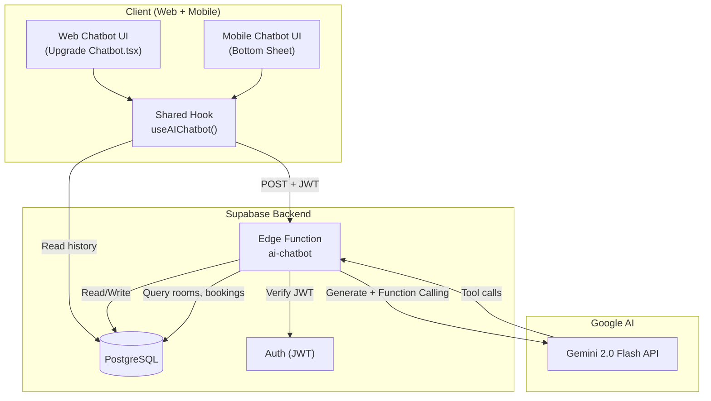
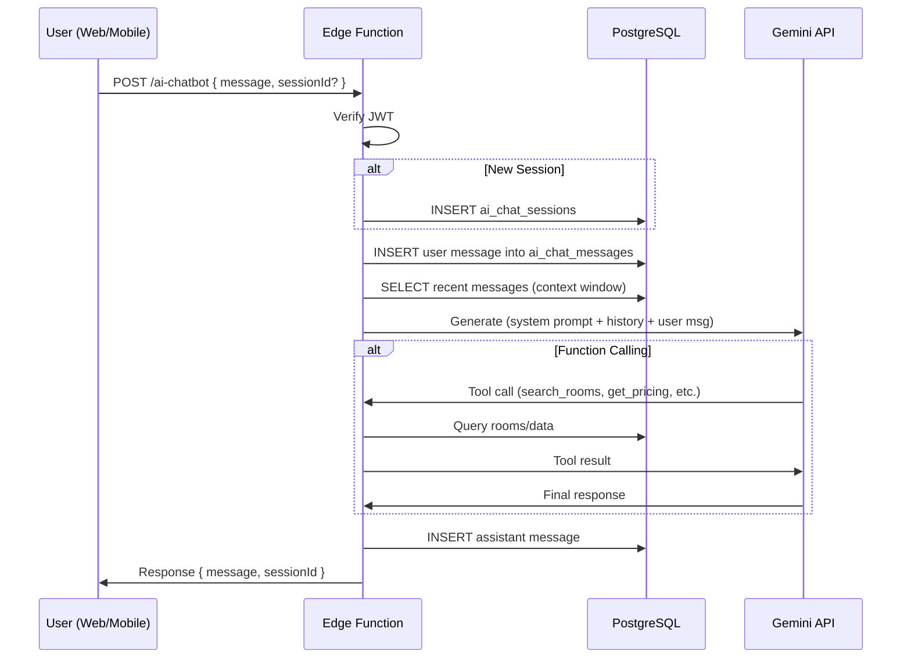

# AI Chatbot — System Design & Architecture

## Architecture Overview



**Key Components:**

| Component | Responsibility | Technology |
|-----------|---------------|------------|
| **AI Chatbot Edge Function** | Xử lý message, gọi Gemini, function calling, lưu DB | Deno (Supabase Edge Function) |
| **Shared Hook** | State management, API calls, optimistic UI | React hook (`useAIChatbot`) trong `@roomz/shared` |
| **Web UI** | Chatbot drawer/modal trên web | React + Tailwind (upgrade `Chatbot.tsx`) |
| **Mobile UI** | Chatbot bottom sheet trên mobile | React Native + NativeWind |
| **DB Tables** | Lưu chatbot conversations + messages | PostgreSQL (Supabase) |

## Data Models

### Bảng mới: `ai_chat_sessions`

> Tách riêng khỏi user-to-user chat để tránh conflict logic.

```sql
CREATE TABLE ai_chat_sessions (
    id UUID PRIMARY KEY DEFAULT gen_random_uuid(),
    user_id UUID NOT NULL REFERENCES auth.users(id) ON DELETE CASCADE,
    title TEXT, -- Auto-generated from first message
    created_at TIMESTAMPTZ DEFAULT now(),
    updated_at TIMESTAMPTZ DEFAULT now()
);

CREATE INDEX idx_ai_chat_sessions_user ON ai_chat_sessions(user_id);
```

### Bảng mới: `ai_chat_messages`

```sql
CREATE TABLE ai_chat_messages (
    id UUID PRIMARY KEY DEFAULT gen_random_uuid(),
    session_id UUID NOT NULL REFERENCES ai_chat_sessions(id) ON DELETE CASCADE,
    role TEXT NOT NULL CHECK (role IN ('user', 'assistant', 'system')),
    content TEXT NOT NULL,
    metadata JSONB DEFAULT '{}', -- function call results, sources, etc.
    created_at TIMESTAMPTZ DEFAULT now()
);

CREATE INDEX idx_ai_chat_messages_session ON ai_chat_messages(session_id);
CREATE INDEX idx_ai_chat_messages_created ON ai_chat_messages(session_id, created_at);
```

### RLS Policies

```sql
-- Users can only access their own sessions
ALTER TABLE ai_chat_sessions ENABLE ROW LEVEL SECURITY;
CREATE POLICY "Users can view own sessions" ON ai_chat_sessions
    FOR SELECT USING (auth.uid() = user_id);
CREATE POLICY "Users can create own sessions" ON ai_chat_sessions
    FOR INSERT WITH CHECK (auth.uid() = user_id);
CREATE POLICY "Users can delete own sessions" ON ai_chat_sessions
    FOR DELETE USING (auth.uid() = user_id);

-- Users can only access messages in their sessions
ALTER TABLE ai_chat_messages ENABLE ROW LEVEL SECURITY;
CREATE POLICY "Users can view own messages" ON ai_chat_messages
    FOR SELECT USING (
        EXISTS (SELECT 1 FROM ai_chat_sessions WHERE id = session_id AND user_id = auth.uid())
    );
CREATE POLICY "Users can insert own messages" ON ai_chat_messages
    FOR INSERT WITH CHECK (
        EXISTS (SELECT 1 FROM ai_chat_sessions WHERE id = session_id AND user_id = auth.uid())
    );
```

### Data Flow



## API Design

### Edge Function: `ai-chatbot`

**Endpoint:** `POST /functions/v1/ai-chatbot`

**Headers:**
```
Authorization: Bearer <JWT>
Content-Type: application/json
```

**Request Body:**
```typescript
interface AIChatRequest {
    message: string;           // User's message
    sessionId?: string;        // Existing session (null = new)
}
```

**Response:**
```typescript
interface AIChatResponse {
    message: string;           // AI response text
    sessionId: string;         // Session ID (new or existing)
    metadata?: {
        functionCalls?: Array<{
            name: string;
            result: unknown;
        }>;
        sources?: string[];    // Referenced data sources
    };
}
```

**Error Response:**
```typescript
interface AIChatError {
    error: string;
    code: 'RATE_LIMITED' | 'GEMINI_ERROR' | 'AUTH_ERROR' | 'INVALID_INPUT';
}
```

### Gemini Function Declarations

```typescript
const tools = [
    {
        name: 'search_rooms',
        description: 'Tìm phòng theo tiêu chí (khu vực, giá, loại phòng)',
        parameters: {
            type: 'object',
            properties: {
                city: { type: 'string', description: 'Thành phố (e.g., "Hồ Chí Minh")' },
                district: { type: 'string', description: 'Quận/Huyện' },
                maxPrice: { type: 'number', description: 'Giá tối đa (VND/tháng)' },
                minPrice: { type: 'number', description: 'Giá tối thiểu (VND/tháng)' },
                roomType: { type: 'string', enum: ['single', 'shared', 'studio', 'apartment'] },
            }
        }
    },
    {
        name: 'get_room_details',
        description: 'Lấy thông tin chi tiết của một phòng cụ thể',
        parameters: {
            type: 'object',
            properties: {
                roomId: { type: 'string', description: 'ID của phòng' }
            },
            required: ['roomId']
        }
    },
    {
        name: 'get_app_info',
        description: 'Lấy thông tin về tính năng RommZ (xác thực, RommZ+, SwapRoom, etc.)',
        parameters: {
            type: 'object',
            properties: {
                topic: { type: 'string', enum: ['verification', 'rommz_plus', 'swap_room', 'services', 'perks', 'general'] }
            },
            required: ['topic']
        }
    }
];
```

## Component Breakdown

### Shared (`@roomz/shared`)

| File | Purpose |
|------|---------|
| `services/ai-chatbot/api.ts` | API calls to Edge Function |
| `services/ai-chatbot/types.ts` | TypeScript interfaces |

### Web

| File | Purpose |
|------|---------|
| `components/common/Chatbot.tsx` | **UPGRADE** existing chatbot with AI |
| `hooks/useAIChatbot.ts` | Web-specific hook wrapping shared API |

### Mobile

| File | Purpose |
|------|---------|
| `components/AIChatbot.tsx` | Chatbot bottom sheet component |
| `components/AIChatMessage.tsx` | Message bubble (AI vs User) |
| `hooks/useAIChatbot.ts` | Mobile-specific hook wrapping shared API |

### Edge Function

| File | Purpose |
|------|---------|
| `supabase/functions/ai-chatbot/index.ts` | Main handler |

## Design Decisions

| Decision | Choice | Rationale |
|----------|--------|-----------|
| Tách bảng AI chat | Bảng riêng (`ai_chat_sessions`, `ai_chat_messages`) | Tránh conflict với user-to-user chat, schema khác (role field, metadata) |
| Non-streaming (MVP) | Request-response | Đơn giản hơn, streaming thêm sau nếu cần |
| Context window | 20 messages gần nhất | Cân bằng giữa context quality và token cost |
| System prompt | Hardcoded trong Edge Function | Dễ update, không cần DB |
| Rate limiting | Ở Edge Function level | 10 requests/phút per user |

## Non-Functional Requirements

| Requirement | Target |
|-------------|--------|
| Response time | < 3s (FAQ), < 5s (DB queries) |
| Availability | 99.9% (phụ thuộc Supabase + Gemini) |
| Security | JWT auth required, API key server-side only |
| Rate limit | 10 req/min per user |
| Context | 20 messages recent history |
| Data retention | Indefinite (user can delete sessions) |
