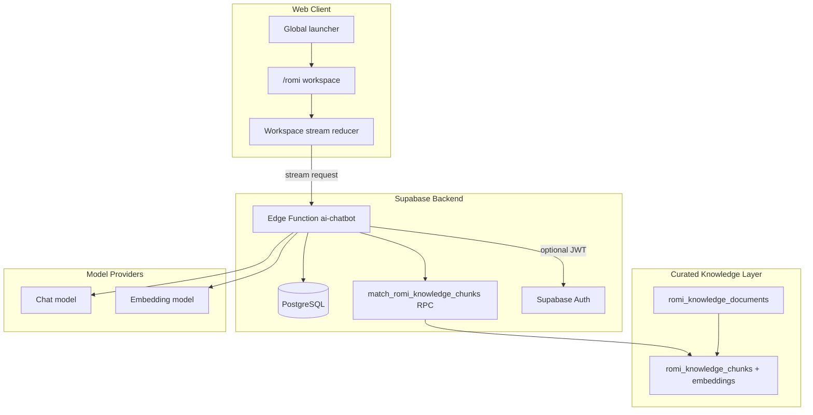
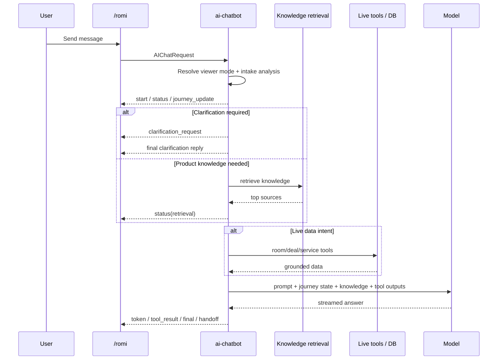

# AI Chatbot - System Design & Architecture

## Architecture Overview



## Product Shape

- `/romi` is the primary ROMI workspace.
- The floating launcher is only a fast entry point into `/romi`.
- Signed-out users operate in `guest` mode:
  - no DB persistence
  - public/product queries only
  - login handoff when the flow becomes personalized or gated
- Signed-in users operate in `user` mode:
  - session persistence
  - journey-state carry-over
  - deep room/deal/service guidance

## Runtime Modules

The public edge function remains `supabase/functions/ai-chatbot/index.ts`, but ROMI v3 now delegates core concerns into separate modules.

| Module | Responsibility |
|---|---|
| `packages/shared/src/services/ai-chatbot/intake.ts` | Infer intent, extract journey data, determine clarification needs |
| `packages/shared/src/services/ai-chatbot/journey.ts` | Merge and summarize user journey state |
| `supabase/functions/ai-chatbot/knowledge.ts` | Knowledge corpus seeding, retrieval, lexical fallback, source formatting |
| `supabase/functions/ai-chatbot/fallback-policy.ts` | Clarification and guest handoff policy |
| `supabase/functions/ai-chatbot/response-composer.ts` | ROMI system prompt and knowledge-only fallback replies |

The tool-routing and live inventory composition logic still lives in the edge entrypoint and remains a future cleanup target.

## Shared Contracts

### `AIChatRequest`

```ts
interface AIChatRequest {
  message: string;
  sessionId?: string | null;
  viewerMode?: "guest" | "user";
  entryPoint?: "launcher" | "romi_page" | "contextual_handoff";
  pageContext?: {
    route: string;
    roomId?: string;
    surface?: string;
  };
  journeyState?: Partial<RomiJourneyState>;
  history?: AIChatHistoryEntry[];
}
```

### `AIChatStreamEvent`

ROMI v3 keeps the stream-first model and adds structured experience events:

- `journey_update`
- `clarification_request`
- `handoff`

These sit alongside existing streaming events such as `start`, `status`, `token`, `tool_result`, `final`, and `error`.

## Data Model

### Existing tables extended

```sql
alter table public.ai_chat_sessions
  add column experience_version text not null default 'romi_v3',
  add column journey_state jsonb not null default '{}'::jsonb;
```

### New tables

```sql
create table public.romi_knowledge_documents (
  id uuid primary key default gen_random_uuid(),
  slug text not null unique,
  title text not null,
  section text not null,
  audience text not null,
  summary text,
  metadata jsonb not null default '{}'::jsonb
);

create table public.romi_knowledge_chunks (
  id uuid primary key default gen_random_uuid(),
  document_id uuid not null references public.romi_knowledge_documents(id) on delete cascade,
  chunk_id text not null unique,
  chunk_index integer not null,
  section text not null,
  audience text not null,
  content text not null,
  embedding extensions.vector(768),
  metadata jsonb not null default '{}'::jsonb
);
```

### Retrieval

- Embeddings are stored in `romi_knowledge_chunks.embedding`.
- Retrieval happens through `public.match_romi_knowledge_chunks(...)`.
- If embeddings are unavailable, ROMI falls back to lexical scoring over the curated corpus.

## Journey-State Model

`journey_state` captures the assistant's working understanding instead of forcing the model to reconstruct it every turn.

Representative fields:

- `stage`
- `intent`
- `summary`
- `city`
- `district`
- `areaHint`
- `budgetMin`
- `budgetMax`
- `roomType`
- `urgency`
- `productTopic`
- `serviceCategory`
- `missingFields`
- `groundedBy`

## Interaction Flow



## Web UI Design

`packages/web/src/pages/RomiPage.tsx` now follows a reducer-driven workspace layout:

- left rail:
  - signed-in session history
  - guest-mode explanation and login CTA
- center surface:
  - intake hero
  - message thread
  - sticky composer
- right rail:
  - journey summary
  - clarification prompt
  - handoff card
  - knowledge sources
  - next-step actions

The reducer prevents token-by-token updates from forcing a full page-level reset.

## Key Design Decisions

| Decision | Choice | Rationale |
|---|---|---|
| Persistence | Signed-in only | Guest discovery should stay lightweight and accessible |
| RAG scope | Knowledge-only | Policies and pricing benefit from curation; live inventory must stay tool-first |
| Session compatibility | Versioned via `experience_version` | Avoids messy migration of old ROMI sessions |
| Retrieval seeding | Lazy first-request upsert | Fastest path to get curated knowledge into production flow |
| UI state | Reducer-based stream workspace | Better control over partial events, handoff, and clarification |

## Known Tradeoffs

- Guest rate limiting is currently in-memory, so it is not durable across isolates.
- Knowledge seeding on request adds some startup cost to the first hit in a cold environment.
- The edge function still contains legacy monolithic areas around tool orchestration that should be modularized later.
