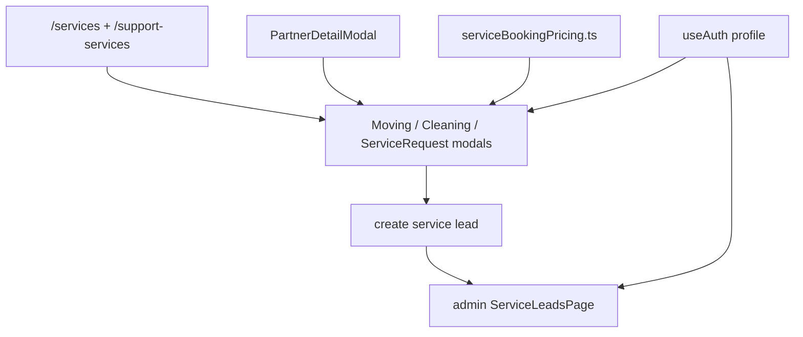

# Services Area Bugfixes - Design

## Architecture Overview

## Design Decisions

- Unify estimate logic in `serviceBookingPricing.ts` so moving and cleaning pricing rules are not duplicated inside modal components.
- Keep the new repair, laundry, and setup flow as a lightweight request modal rather than reopening the deprecated chat fallback.
- Route partner CTA behavior through explicit booking-target inference so booking stays contextual to the selected partner.
- Use real review fetches in partner detail and show an empty state when review data is absent instead of leaving a stub section.
- Replace the narrow cleaning type pills with responsive selectable cards so the UI survives mobile-width modal layouts.
- Prefer shadcn `Select` over raw HTML `select` to keep service-form controls visually consistent.

## Component Boundaries

- `ServicesHubPage.tsx`
  - service routing, hero CTA state, and partner-bound modal entry
- `SupportServicesPage.tsx`
  - setup booking route and empty-state polish
- `BookMovingModal.tsx`
  - moving-specific fields, estimate breakdown, and verified-student discount gate
- `CleaningScheduleModal.tsx`
  - cleaning-specific estimator, responsive type selector, add-ons, and verified-student discount gate
- `ServiceRequestModal.tsx`
  - generic request path for `repair`, `laundry`, and `setup`
- `PartnerDetailModal.tsx`
  - review fetch and contextual booking handoff
- `ServiceLeadsPage.tsx`
  - admin labels, note identity, status cards, and cancel action

## Non-Functional Requirements

- Booking controls must stay usable on narrow modal widths without text overlap or clipped CTAs.
- User-facing discount and estimate messaging must not imply entitlement or pricing rules that the app cannot justify from current state.
- Admin lead presentation must remain readable even when new support categories and details are added.
