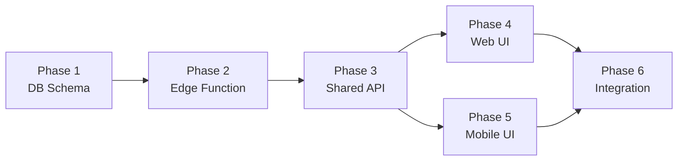

# AI Chatbot — Project Planning & Task Breakdown

## Milestones

- [ ] Milestone 1: Database & Edge Function Foundation
- [ ] Milestone 2: Shared API Layer
- [ ] Milestone 3: Web Chatbot UI (Upgrade)
- [ ] Milestone 4: Mobile Chatbot UI
- [ ] Milestone 5: Integration Testing & Polish

## Task Breakdown

### Phase 1: Database Schema (Foundation)

- [ ] Task 1.1: Create migration for `ai_chat_sessions` table
- [ ] Task 1.2: Create migration for `ai_chat_messages` table
- [ ] Task 1.3: Add RLS policies for both tables
- [ ] Task 1.4: Verify migration with `npx supabase db push` or MCP

### Phase 2: Edge Function — AI Chatbot

- [ ] Task 2.1: Create `supabase/functions/ai-chatbot/index.ts`
  - CORS handling
  - JWT verification
  - Request parsing
- [ ] Task 2.2: Implement Gemini API integration
  - System prompt (RommZ context, Vietnamese)
  - Chat history context (20 messages)
  - Temperature, safety settings
- [ ] Task 2.3: Implement function calling tools
  - `search_rooms`: Query rooms table by city, district, price range
  - `get_room_details`: Get room by ID
  - `get_app_info`: Static info about app features
- [ ] Task 2.4: Implement DB operations
  - Create/get session
  - Save user + assistant messages
  - Rate limiting (10 req/min)
- [ ] Task 2.5: Add `GEMINI_API_KEY` to Supabase secrets
- [ ] Task 2.6: Deploy & test Edge Function
- [x] Task 2.7: Migrate model orchestration to Vercel AI SDK (`ai` + `@ai-sdk/google`) with bounded tool loop (`stepCountIs(1)`)

### Phase 3: Shared API Layer (`@roomz/shared`)

- [ ] Task 3.1: Create `packages/shared/src/services/ai-chatbot/types.ts`
- [ ] Task 3.2: Create `packages/shared/src/services/ai-chatbot/api.ts`
  - `sendAIChatMessage(supabase, message, sessionId?)`
  - `getAIChatSessions(supabase, userId)`
  - `getAIChatMessages(supabase, sessionId)`
  - `deleteAIChatSession(supabase, sessionId)`
- [ ] Task 3.3: Export from shared index

### Phase 4: Web Chatbot UI (Upgrade)

- [ ] Task 4.1: Create `packages/web/src/hooks/useAIChatbot.ts`
  - TanStack Query integration
  - Optimistic UI updates
  - Session management
- [ ] Task 4.2: Upgrade `packages/web/src/components/common/Chatbot.tsx`
  - Replace hardcoded `getBotResponse` with AI API call
  - Add session/history support
  - Loading states, error states
  - Typing indicator animation
- [ ] Task 4.3: Verify web chatbot works end-to-end

### Phase 5: Mobile Chatbot UI

- [ ] Task 5.1: Create `packages/mobile/src/hooks/useAIChatbot.ts`
- [ ] Task 5.2: Create `packages/mobile/components/AIChatMessage.tsx`
- [ ] Task 5.3: Create `packages/mobile/components/AIChatbot.tsx` (Bottom Sheet)
- [ ] Task 5.4: Add chatbot entry point (FAB button or tab)
- [ ] Task 5.5: Verify mobile chatbot works end-to-end

### Phase 6: Integration & Polish

- [ ] Task 6.1: TypeScript check (`npx tsc --noEmit`) across all packages
- [ ] Task 6.2: Test cross-platform session sync
- [ ] Task 6.3: Test function calling (room search queries)
- [ ] Task 6.4: Edge case testing (rate limit, long messages, errors)

## Dependencies

**External Dependencies:**

- Google Gemini API key (user needs to create in Google AI Studio)
- Supabase project access for secrets & Edge Function deployment

## Timeline & Estimates

| Phase | Estimated Effort | Priority |
|-------|-----------------|----------|
| Phase 1: DB Schema | 30 min | P0 |
| Phase 2: Edge Function | 2-3 hours | P0 |
| Phase 3: Shared API | 30 min | P0 |
| Phase 4: Web UI | 1-2 hours | P1 |
| Phase 5: Mobile UI | 1-2 hours | P1 |
| Phase 6: Integration | 1 hour | P1 |
| **Total** | **~6-9 hours** | |

## Risks & Mitigation

| Risk | Impact | Mitigation |
|------|--------|-----------|
| Gemini API rate limits (free tier) | Response failures | Implement retry + fallback response |
| Slow Gemini response | Poor UX | Add loading indicator, consider streaming later |
| Function calling inaccuracy | Wrong room results | Careful prompt engineering, validate tool outputs |
| Token cost growth | Unexpected billing | Limit context window to 20 messages, rate limit users |

## Resources Needed

- **API Key**: Google AI Studio → Gemini API key
- **Supabase**: Edge Function deployment, DB migration
- **Packages**: `@google/generative-ai` (for Deno: npm specifier in Edge Function)
