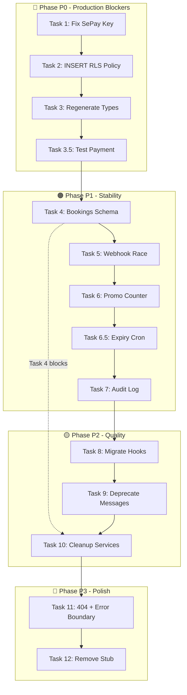

# RoomZ Codebase Audit - Remediation Plan

> **Date**: 2026-03-05  
> **Source**: codebase_audit_report.md.resolved  
> **Scope**: Full remediation of 12 identified issues

---

## Executive Summary

This plan addresses **12 critical-to-low priority issues** identified in the RoomZ codebase audit. Issues are organized by severity and execution phases.

| Phase | Issues | Effort | Priority |
|-------|--------|--------|----------|
| P0 - Production Blockers | 3 tasks | ~30 min | 🔴 Critical |
| P1 - Stability & Schema | 5 tasks | ~4-5h | 🟠 High |
| P2 - Code Quality | 4 tasks | ~5-6h | 🟡 Medium |
| P3 - Polish | 2 tasks | ~45 min | 🔵 Low |

---

## Phase P0: Production Blockers (CRITICAL)

> **⚠️ DO NOT DEPLOY TO PRODUCTION until Phase P0 is complete**

### Task 1: Fix SePay API Key + Move Secrets to `.env.local`
**Agent**: @security-auditor  
**Effort**: 10 minutes  
**Files**: `.env`, `.env.local` (create)

#### Issues:
- `VITE_SEPAY_API_KEY=sandbox_key` with production URL `https://pgapi.sepay.vn`
- Secrets in `.env` instead of `.env.local` (gitignored)

#### Steps:
1. [ ] Create `.env.local` file (gitignored)
2. [ ] Move all secrets from `.env` to `.env.local`:
   ```bash
   VITE_SUPABASE_URL=https://...
   VITE_SUPABASE_ANON_KEY=sb_...
   VITE_SEPAY_API_KEY=<REAL_PRODUCTION_KEY>
   VITE_MAPBOX_ACCESS_TOKEN=pk.eyJ...
   ```
3. [ ] Replace secrets in `.env` with placeholders:
   ```bash
   VITE_SUPABASE_URL=your_supabase_url
   VITE_SUPABASE_ANON_KEY=your_supabase_anon_key
   VITE_SEPAY_API_KEY=your_sepay_api_key
   ```
4. [ ] Add `.env.local` to `.gitignore` if not present

#### Verification:
- [ ] Run `git status` - `.env.local` should not appear
- [ ] Run `git diff .env` - secrets should be replaced with placeholders
- [ ] App still runs with `npm run dev` (reads from `.env.local`)

---

### Task 2: Add INSERT RLS Policy for `payment_orders`
**Agent**: @database-architect  
**Effort**: 5 minutes  
**File**: New migration

#### Issue:
Migration `20260227_sepay_refactor.sql` only has SELECT policy - users cannot create orders.

#### Steps:
1. [ ] Create new migration: `supabase/migrations/20260305_payment_orders_insert_rls.sql`
2. [ ] Add INSERT policy:
   ```sql
   -- Allow authenticated users to create their own payment orders
   DROP POLICY IF EXISTS "Users can insert own orders" ON payment_orders;
   CREATE POLICY "Users can insert own orders" ON payment_orders
   FOR INSERT
   WITH CHECK (auth.uid() = user_id);
   ```
3. [ ] Add UPDATE policy (for cancel order):
   ```sql
   -- Allow users to update their own orders (e.g., cancel)
   DROP POLICY IF EXISTS "Users can update own orders" ON payment_orders;
   CREATE POLICY "Users can update own orders" ON payment_orders
   FOR UPDATE USING (auth.uid() = user_id)
   WITH CHECK (auth.uid() = user_id);
   ```
4. [ ] Apply migration: `supabase db push`

#### Verification:
- [ ] Check policies: `SELECT * FROM pg_policies WHERE tablename = 'payment_orders';`
- [ ] Test from client: `supabase.from('payment_orders').insert({...})` should succeed

---

### Task 3: Regenerate `database.types.ts`
**Agent**: @backend-specialist  
**Effort**: 15 minutes  
**File**: `packages/web/src/lib/database.types.ts`

#### Issue:
Missing tables: `subscriptions`, `payment_orders`, `manual_reviews` causing 30+ `as any` casts.

#### Steps:
1. [ ] Ensure all migrations are applied to local/production
2. [ ] Run type generation:
   ```bash
   supabase gen types typescript --project-id vevnoxlgwisdottaifdn --schema public --linked > packages/web/src/lib/database.types.ts
   ```
3. [ ] Update imports in affected files:
   - Remove `as any` from `payments.ts` lines 95, 143, 160, 177, 246
   - Remove `as any` from `admin-payments.ts`
   - Remove `as any` from `community.ts`

#### Verification:
- [ ] `npm run typecheck` passes with 0 errors
- [ ] No `as any` casts for `subscriptions`, `payment_orders`, `manual_reviews`

---

### Task 3.5: Test Payment Flow End-to-End
**Agent**: @backend-specialist  
**Effort**: 30 minutes

#### Steps:
1. [ ] Create test order in dev environment
2. [ ] Verify QR code generates correctly
3. [ ] Mock webhook payload to verify handler works
4. [ ] Verify subscription created after webhook

#### Verification:
- [ ] `payment_orders` row created with status 'pending'
- [ ] Webhook processes successfully (200 response)
- [ ] `subscriptions` row created with status 'active'
- [ ] User's `is_premium` updated to true

---

## Phase P1: Stability & Schema (HIGH)

### Task 4: Thống nhất Bookings Schema (Web vs Shared)
**Agents**: @database-architect + @backend-specialist  
**Effort**: 1-2 hours  
**Files**: `packages/web/src/services/bookings.ts`, `packages/shared/src/services/bookings.ts`

#### Issue:
- Web: Uses `renter_id`/`landlord_id` (2-way relationship)
- Shared: Uses `user_id` (1-way relationship)
- Cannot simply delete web version due to schema mismatch

#### Decision Required:
**Option A**: Migrate to Web schema (`renter_id`/`landlord_id`) - More explicit, better for role-based queries  
**Option B**: Migrate to Shared schema (`user_id`) - Simpler, but loses landlord context

**Recommendation**: Option A - Update Shared to match Web schema

#### Steps (Option A):
1. [ ] Update `packages/shared/src/services/bookings.ts`:
   - Change `user_id` → `renter_id`
   - Add `landlord_id` parameter
   - Update SQL queries to join with `rooms` table for landlord context
2. [ ] Update `packages/web/src/services/index.ts` exports
3. [ ] Test all booking operations

#### Verification:
- [ ] `npm run typecheck` passes
- [ ] All booking CRUD operations work
- [ ] Tenant view shows their bookings
- [ ] Landlord view shows bookings for their rooms

---

### Task 5: Fix Webhook Race Condition
**Agent**: @backend-specialist  
**Effort**: 30 minutes  
**File**: `supabase/functions/sepay-webhook/index.ts`

#### Issue:
No transaction lock - 2 concurrent webhooks could create duplicate subscriptions.

#### Steps:
1. [ ] Create RPC function for atomic lock:
   ```sql
   CREATE OR REPLACE FUNCTION lock_payment_order(p_order_id UUID)
   RETURNS payment_orders AS $$
     SELECT * FROM payment_orders
     WHERE id = p_order_id
     FOR UPDATE;
   $$ LANGUAGE sql;
   ```
2. [ ] Update webhook to use lock:
   ```typescript
   // After getting order, acquire lock
   await fetch(`${supabaseUrl}/rest/v1/rpc/lock_payment_order`, {
     method: 'POST',
     headers: {
       'apikey': supabaseKey,
       'Authorization': `Bearer ${supabaseKey}`,
       'Content-Type': 'application/json'
     },
     body: JSON.stringify({ p_order_id: order.id })
   });
   ```
3. [ ] Check order.status again after lock (prevent race)

#### Verification:
- [ ] Concurrent webhook tests pass (use artillery.io or similar)
- [ ] Only 1 subscription created even with simultaneous requests

---

### Task 6: Implement Promo Counter Increment
**Agent**: @backend-specialist  
**Effort**: 15 minutes  
**File**: `supabase/functions/sepay-webhook/index.ts`

#### Issue:
Lines 308-311 only log promo, don't increment counter.

#### Steps:
1. [ ] Create RPC function for atomic increment:
   ```sql
   CREATE OR REPLACE FUNCTION increment_promo_counter()
   RETURNS void AS $$
     UPDATE app_configs
     SET value = (value::int + 1)::text,
         updated_at = now()
     WHERE key = 'promo_claimed_count';
   $$ LANGUAGE sql;
   ```
2. [ ] Call RPC from webhook:
   ```typescript
   if (order.amount < (order.billing_cycle === "quarterly" ? 119000 : 49000)) {
     await fetch(`${supabaseUrl}/rest/v1/rpc/increment_promo_counter`, {
       method: 'POST',
       headers: {
         'apikey': supabaseKey,
         'Authorization': `Bearer ${supabaseKey}`
       }
     });
     console.log("[SePay] Promo applied and counter incremented for order:", orderCode);
   }
   ```

#### Verification:
- [ ] After promo payment, `promo_claimed_count` in `app_configs` increments

---

### Task 6.5: Add Payment Orders Expiry Cron (NEW)
**Agent**: @database-architect
**Effort**: 20 minutes
**File**: New migration

#### Issue:
Expired `payment_orders` with status 'pending' are never cleaned up.

#### Steps:
1. [ ] Ensure `pg_cron` extension is enabled:
   ```sql
   CREATE EXTENSION IF NOT EXISTS pg_cron;
   ```
2. [ ] Create migration `20260305_payment_orders_expiry_cron.sql`:
   ```sql
   -- Schedule cron job to run every 30 minutes
   SELECT cron.schedule(
     'cleanup-expired-payment-orders',  -- job name
     '*/30 * * * *',                    -- every 30 minutes
     $$
       UPDATE payment_orders
       SET status = 'expired',
           updated_at = now()
       WHERE status = 'pending'
         AND expires_at < now();
     $$
   );
   
   -- Verify job is scheduled
   SELECT * FROM cron.job WHERE jobname = 'cleanup-expired-payment-orders';
   ```
3. [ ] Apply migration

#### Verification:
- [ ] Cron job appears in `cron.job` table
- [ ] Create test order with `expires_at` in the past
- [ ] Wait 30 min or manually trigger: `SELECT cron.schedule('cleanup-expired-payment-orders', '* * * * *', ...)`
- [ ] Order status changes to 'expired'

---

### Task 7: Add Webhook Audit Log Table
**Agent**: @database-architect  
**Effort**: 30 minutes  
**Files**: New migration, webhook function

#### Issue:
No persistent logging for webhook failures (Supabase logs only 24h).

#### Steps:
1. [ ] Create migration `20260305_webhook_audit_log.sql`:
   ```sql
   CREATE TABLE webhook_audit_logs (
     id UUID PRIMARY KEY DEFAULT gen_random_uuid(),
     source TEXT NOT NULL DEFAULT 'sepay',
     payload JSONB,
     status TEXT NOT NULL, -- 'success', 'failed', 'duplicate'
     error_message TEXT,
     order_code TEXT,
     processed_at TIMESTAMPTZ DEFAULT now()
   );
   
   CREATE INDEX idx_webhook_audit_order ON webhook_audit_logs(order_code);
   CREATE INDEX idx_webhook_audit_status ON webhook_audit_logs(status);
   ```
2. [ ] Update webhook to log:
   - All incoming webhooks
   - Processing result
   - Error details on failure

#### Verification:
- [ ] Table created
- [ ] Every webhook creates audit log entry
- [ ] Failed webhooks have error_message populated

---

## Phase P2: Code Quality (MEDIUM)

### Task 8: Migrate 5 Hooks → TanStack Query
**Agent**: @frontend-specialist  
**Effort**: 3-4 hours  
**Files**: 5 hook files

#### Hooks to Migrate:
| Hook | Current Pattern | TanStack Pattern |
|------|----------------|------------------|
| `useBookings.ts` | Manual `useState/useEffect` | `useQuery` + `useMutation` |
| `useNotifications.ts` | Manual `useState/useEffect` | `useQuery` + realtime subscription |
| `useFavorites.ts` | Manual with optimistic update | `useMutation` with `onMutate` |
| `useMessages.ts` (legacy) | Manual `useState/useEffect` | Already have `chat/useMessages.ts` |
| `usePremiumLimits.ts` | Manual state | `useQuery` |

#### Steps:
1. [ ] Migrate `useBookings.ts`:
   - Use `useQuery` for fetching
   - Use `useMutation` for create/cancel
   - Add optimistic updates
2. [ ] Migrate `useNotifications.ts`:
   - Use `useQuery` for initial fetch
   - Keep realtime subscription for updates
   - Use `useMutation` for mark-as-read
3. [ ] Migrate `useFavorites.ts`:
   - Use `useMutation` with `onMutate` for optimistic updates
   - Keep rollback logic (already good pattern)
4. [ ] Migrate `usePremiumLimits.ts`:
   - Simple `useQuery` with short staleTime
5. [ ] Deprecate legacy `useMessages.ts`

#### Reference Implementation:
See `useCommunity.ts` for gold standard pattern.

#### Verification:
- [ ] All hooks have `useQuery`/`useMutation`
- [ ] Loading/error states work
- [ ] Optimistic updates work
- [ ] Cache invalidation works

---

### Task 9: Deprecate Legacy `useMessages.ts`
**Agent**: @frontend-specialist  
**Effort**: 1 hour  
**Files**: `hooks/useMessages.ts`, `hooks/index.ts`

#### Issue:
Legacy `useMessages.ts` (338 lines, manual state) coexists with `chat/useMessages.ts` (161 lines, TanStack Query).

#### Steps:
1. [ ] Mark legacy exports as `@deprecated` in JSDoc
2. [ ] Update all imports in components to use `chat/useMessages.ts`
3. [ ] Add deprecation warnings in console for legacy hook usage
4. [ ] Create migration guide in comments

#### Verification:
- [ ] No components import from legacy `useMessages.ts`
- [ ] Legacy exports marked `@deprecated`

---

### Task 10: Dọn Duplicate Services
**Agent**: @backend-specialist  
**Effort**: 1-2 hours  
**Files**: `services/roommates.ts`, `services/bookings.ts`, `services/index.ts`

#### Issue:
- Web `roommates.ts` (814 lines) overrides Shared `roommates.ts` (613 lines)
- Web `bookings.ts` conflicts with Shared after Task 4
- Export conflict in `services/index.ts:229`

#### Dependencies:
**⚠️ BLOCKED by Task 4** - Must complete bookings schema unification first

#### Steps:
1. [ ] After Task 4 completes, delete `packages/web/src/services/roommates.ts`
2. [ ] Remove line 229 from `services/index.ts`: `export * from './roommates'`
3. [ ] Delete `packages/web/src/services/bookings.ts`
4. [ ] Verify all imports still work
5. [ ] Run full test suite

#### Verification:
- [ ] `npm run typecheck` passes
- [ ] `npm run build` succeeds
- [ ] No duplicate function definitions

---

## Phase P3: Polish (LOW)

### Task 11: Add 404 Page + Error Boundary
**Agent**: @frontend-specialist  
**Effort**: 30 minutes  
**Files**: `router.tsx`, new component

#### Issues:
- Route `*` redirects to `/` silently
- No Error Boundary - app crashes = blank screen

#### Steps:
1. [ ] Create `src/pages/NotFoundPage.tsx`:
   - Friendly message "Trang không tồn tại"
   - Link back to home
   - RoomZ branding
2. [ ] Create `src/components/ErrorBoundary.tsx`:
   - Catch React errors
   - Show fallback UI
   - Log to console/Sentry
3. [ ] Update `router.tsx`:
   - Replace `Navigate to="/"` with `<NotFoundPage />`
   - Wrap routes with ErrorBoundary

#### Verification:
- [ ] Visit `/nonexistent` shows 404 page
- [ ] Throw error in component shows ErrorBoundary UI

---

### Task 12: Remove or Implement `verifyPayment` Stub
**Agent**: @backend-specialist  
**Effort**: 15 minutes  
**File**: `packages/web/src/services/sepay.ts`

#### Issue:
`verifyPayment()` always returns `{ success: false }` with TODO comment.

#### Decision:
**Option A**: Remove entirely (verification happens via webhook anyway)  
**Option B**: Implement polling to check `payment_orders` table

**Recommendation**: Option A - Remove to avoid confusion

#### Steps:
1. [ ] Remove `verifyPayment` function from `sepay.ts`
2. [ ] Remove exports from `services/index.ts` if present
3. [ ] Remove any component usage

#### Verification:
- [ ] `npm run typecheck` passes
- [ ] No references to `verifyPayment` in codebase

---

## Execution Order



---

## Risk Mitigation

| Risk | Impact | Mitigation |
|------|--------|------------|
| SePay key still wrong in prod | 🔴 High | Triple-check `.env.local` before deploy |
| RLS policy too permissive | 🔴 High | Review policy with security auditor |
| Schema migration breaks existing bookings | 🟠 Medium | Backup DB before Task 4, test on staging |
| Webhook race condition persists | 🟠 Medium | Load test with concurrent requests |
| Hook migration breaks UI | 🟡 Low | Test each hook individually |

---

## Success Criteria

- [ ] All P0 tasks complete and tested
- [ ] Payment flow works end-to-end
- [ ] `npm run typecheck` passes with 0 errors
- [ ] `npm run build` succeeds
- [ ] All existing tests pass
- [ ] No `as any` casts for Supabase tables
- [ ] 404 page shows for invalid routes
- [ ] Error Boundary catches React errors

---

## Notes

- **Parallel Work**: Tasks 8-11 can be done in parallel by different devs
- **Rollback Plan**: Keep branch of current state before P0 changes
- **Communication**: Notify team before schema changes (Task 4)
- **Testing**: Create test SePay webhook payloads for local testing
